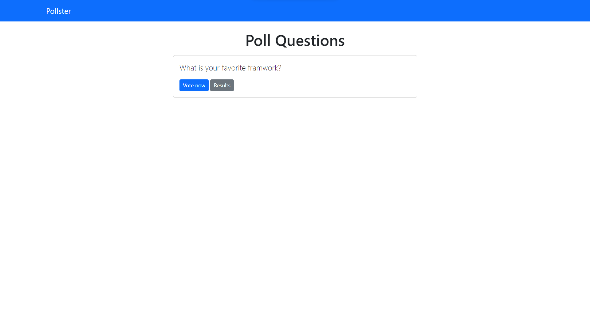
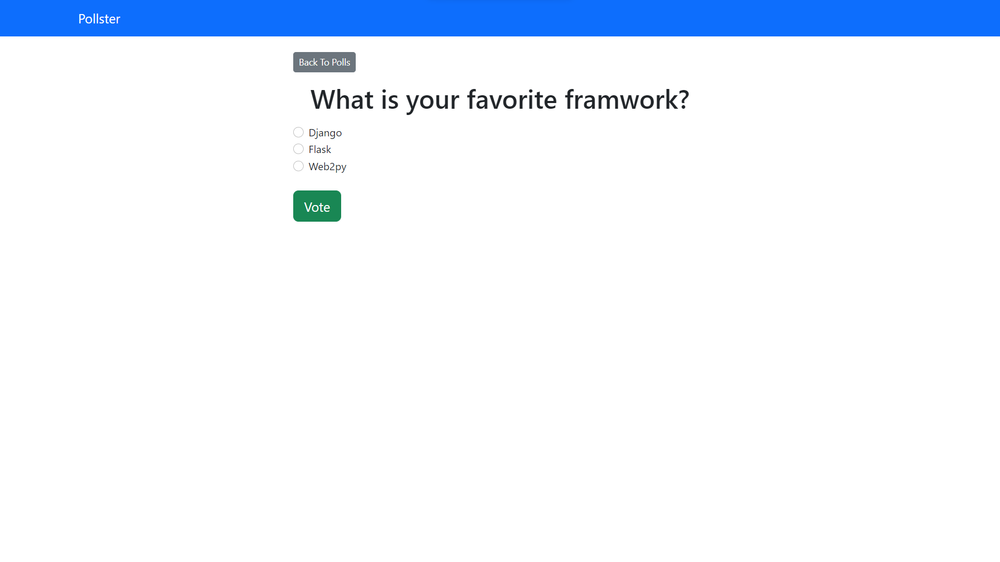
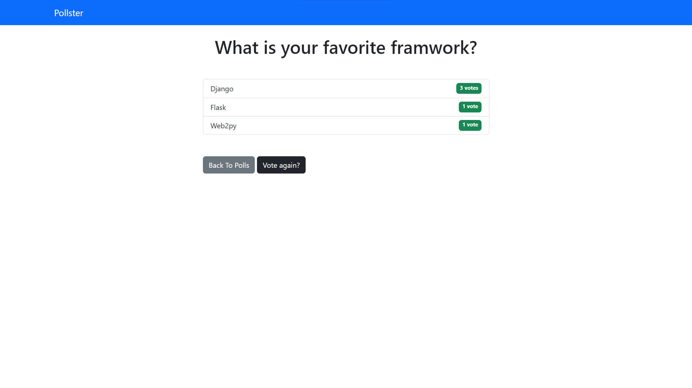

# [Pollster]()

## Table of Contents

- [Built with](#built-with)
- [Features](#features)
- [License](#license)

## Built with

- [Django](https://www.djangoproject.com/)

## Features
* **Design Page**

| Home |
|--|
||

| Available polls |
|--|
||

| Vote |
|--|
||

| Vote results |
|--|
||

---

## License

> This software is licensed under Apache License 2.0 License, See [License](./LICENSE)

